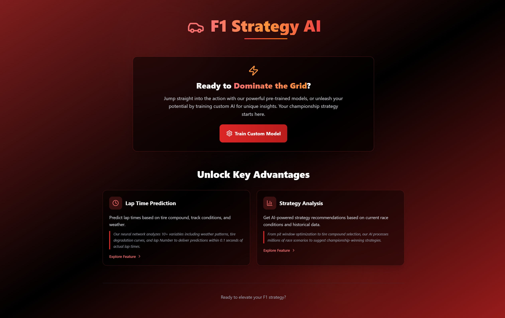
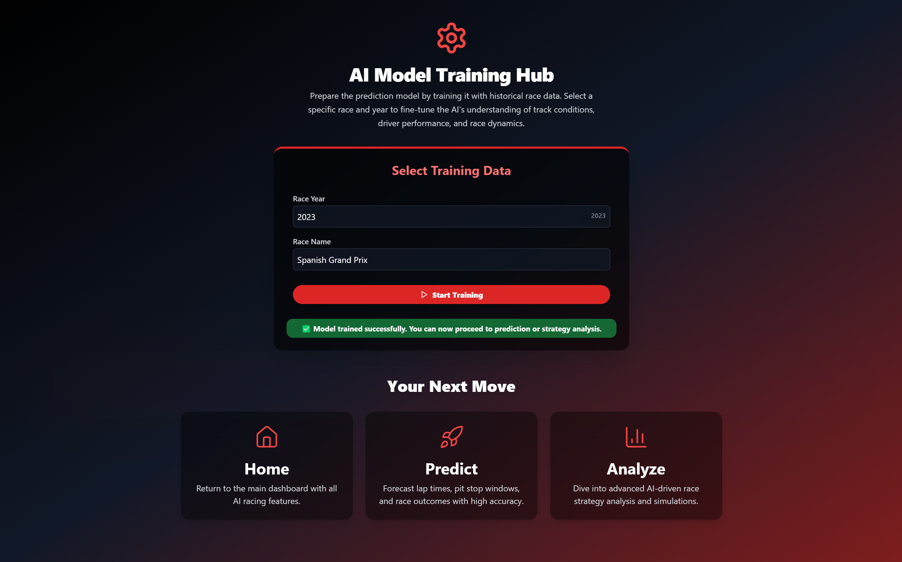
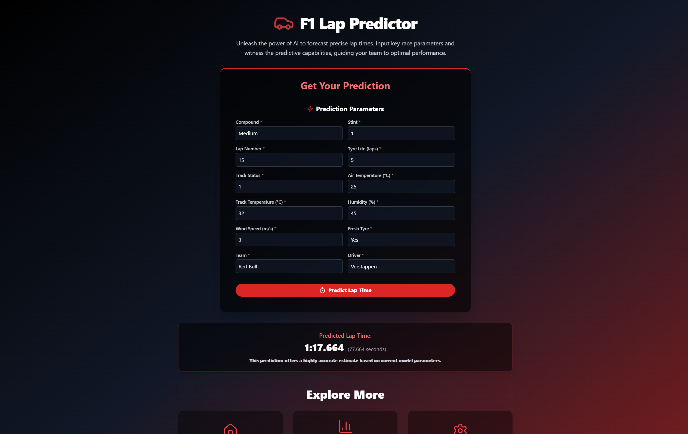
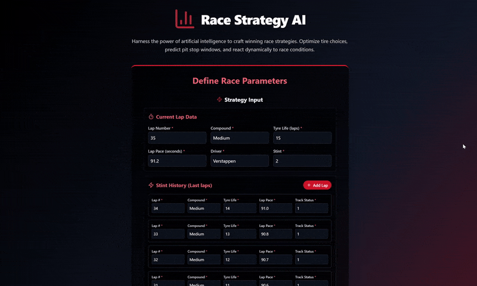

# 🏎️ F1 Strategy AI — Intelligent Race Analytics

    
      
    

---

## Overview

**F1 Strategy AI** is a modern full-stack web app designed to empower Formula 1 teams and fans with AI-driven insights for race strategy and performance prediction. By analyzing extensive race telemetry and environmental data, it helps optimize lap times and championship tactics — turning milliseconds into winning moves.

---

## 🖥️ Demo Pages

- **🏠 Home Page**  
  Overview of the app and its core capabilities.
  

- **⚙️ Model Training Page**  
  Train or refine AI models with historical race data to improve prediction accuracy.
  

- **⏱️ Lap Time Prediction Page**  
  Input race/environment parameters for highly accurate lap time forecasts.
  

- **📊 Strategy Analysis Page**  
  Get comprehensive AI recommendations for race strategy, pit stops, and tire choices.
  

---

## 💡 Why F1 Strategy AI?

In Formula 1, every millisecond and split-second decision impacts race results. Managing huge volumes of real-time telemetry manually is extremely challenging. This app automates and optimizes strategic decisions using cutting-edge AI, delivering actionable insights and a competitive edge to teams and enthusiasts alike. 🏁

---

## 🧾 Project Description

F1 Strategy AI is a powerful, easy-to-use platform that enables users to:

- ⏱️ **Predict lap times** with detailed input on tire compound, stint, lap number, tire wear, track & air conditions — accurate to within 0.1 seconds.  
- 📊 **Analyze race strategies** using AI-driven recommendations for optimal pit stops and tire changes based on current and historical data via FastF1 telemetry.  
- ⚙️ **Train custom AI models** by refining them on race-specific historical data to improve track and driver-specific predictions.

---

## ✨ Key Features

| Feature                 | Description                                                                                 |
|-------------------------|---------------------------------------------------------------------------------------------|
| ⏱️ Lap Time Prediction  | Predict lap times considering tire compound, stint, lap number, tire life, and weather.     |
| 📊 Strategy Analysis    | Receive adaptive, AI-driven pit stop and tire strategy recommendations for dynamic races.  |
| ⚙️ AI Model Training Hub| Train or refine machine learning models with historical race datasets for better accuracy. |
| 🚀 High-Performance API | FastAPI backend with asynchronous processing for efficient, scalable AI model operations.  |
| 🌐 Modern Frontend      | Responsive React + Tailwind CSS frontend built with Vite for fast and smooth UX.            |

---

## 🛠 Installation

### 1. Clone the Repository

```bash
git clone https://github.com/pritpagda/f1-strategy-ai.git
cd f1-strategy-ai
```

### 2. Backend Setup (FastAPI + MongoDB)

```bash
cd backend
python3 -m venv venv
# Windows
venv\Scripts\activate
# macOS/Linux
source venv/bin/activate

pip install -r requirements.txt
```

Create a `.env` file in the `backend` folder and add your environment variables:

```
GEMINI_API_KEY=your_api_key_here
```

Start the backend server:

```bash
uvicorn main:app --reload
```

### 3. Frontend Setup (React + TailwindCSS + Vite)

```bash
cd ../frontend
npm install
npm start
```

Visit [http://localhost:3000](http://localhost:3000) to access the app.

---

## 🧪 How to Use F1 Strategy AI

1. **Train Custom Model:** Select race year and event to train/refine AI models for tailored, accurate predictions.  
2. **Lap Time Prediction:** Input race and environmental parameters for precise lap time forecasts.  
3. **Strategy Analysis:** Get AI-driven recommendations on pit stops, tire strategies, and race tactics based on live and historical data.

---

## ⚙️ Tech Stack Overview

| Layer          | Technologies                                      |
|----------------|--------------------------------------------------|
| 🌐 Frontend    | React, Tailwind CSS, Vite                         |
| ⚙️ Backend     | FastAPI, Pydantic, Uvicorn (ASGI server)         |
| 🤖 AI Layer    | Gemini API (Google Generative AI), Scikit-learn, Pandas, joblib |

---
## Credits

Built with ❤️ by **PritkumarPagda**

---
## 📄 License

This project is licensed under the **MIT License** — see the [LICENSE](LICENSE) file for details.

---
